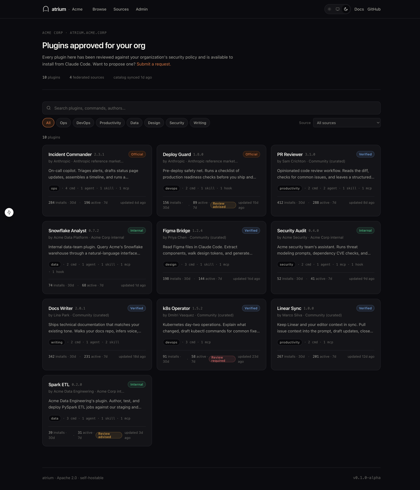
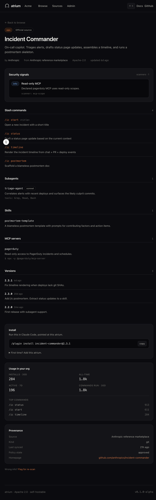
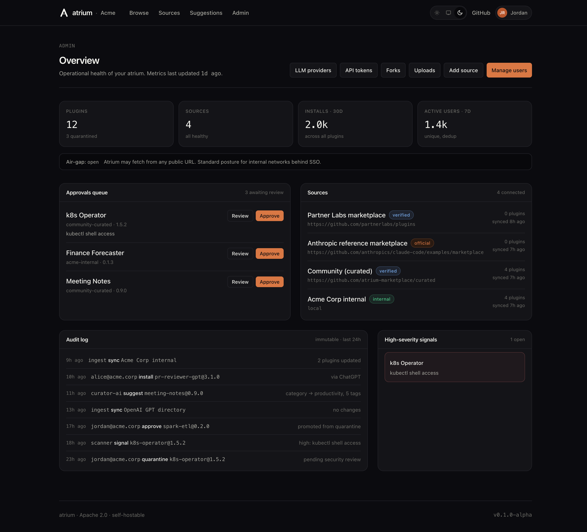
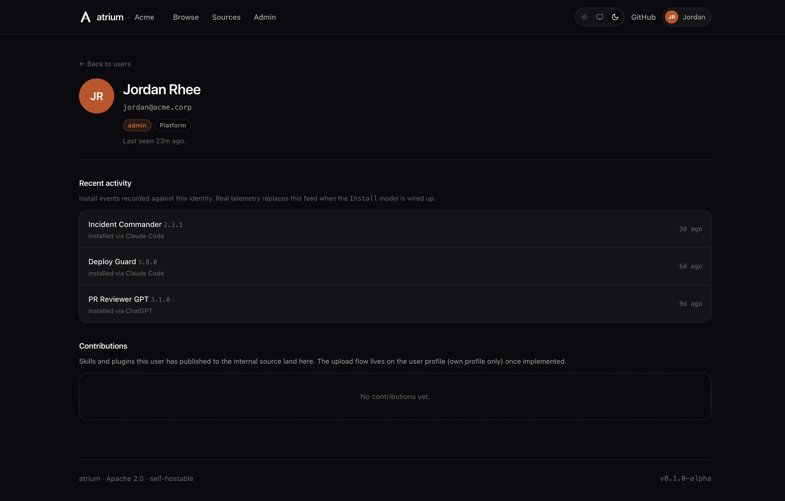
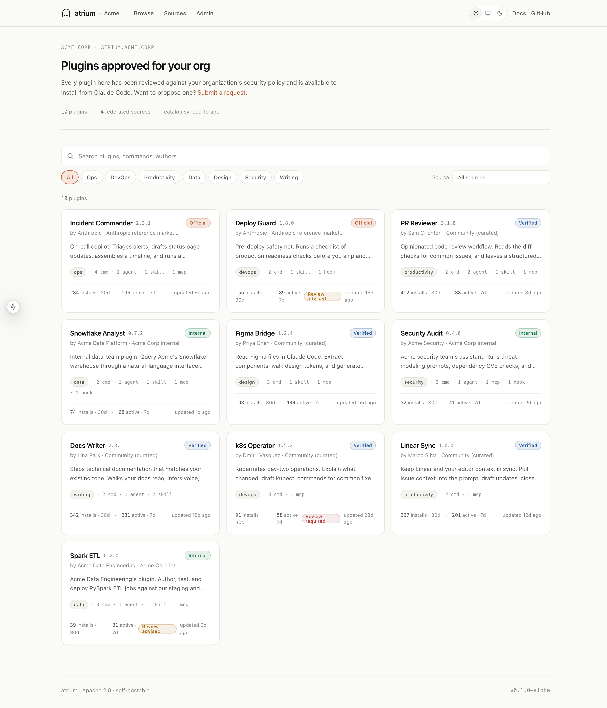
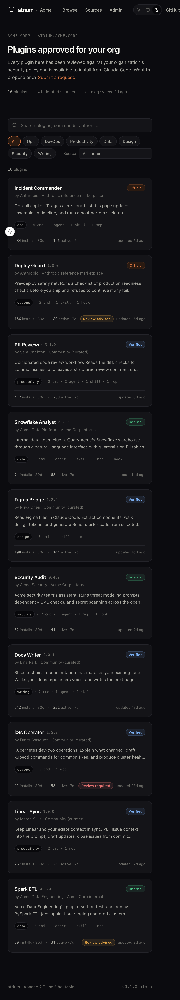
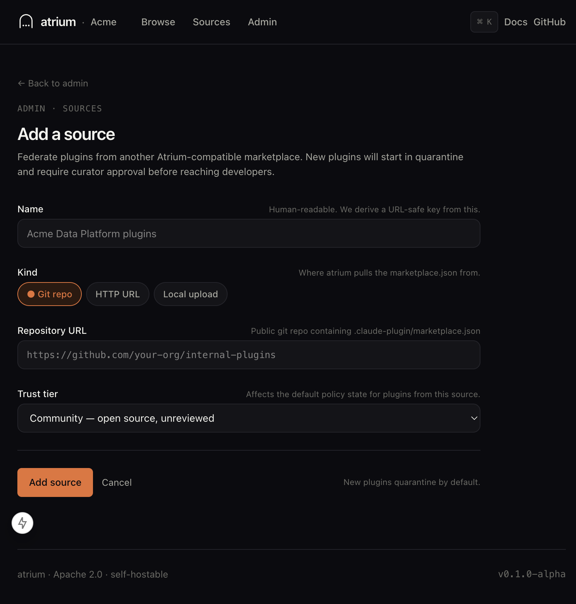
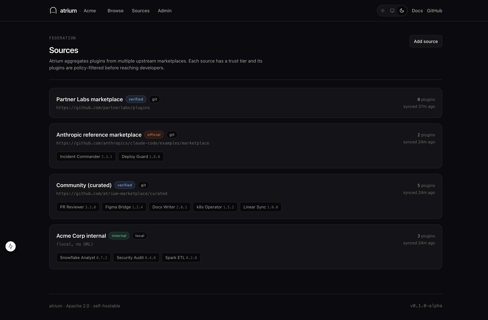

<p align="center">
  
</p>

<p align="center">
  <b>The open plugin registry for AI agents.</b><br>
  Any provider. Any framework. Self-host your own. Federate from others. Audit everything.
</p>

<p align="center">
  <a href="./LICENSE"></a>
  <a href="./ROADMAP.md"></a>
  <a href="./SECURITY.md"></a>
  <a href="https://github.com/kushal-goenka/atrium/actions"></a>
</p>

---

AI agents are going plural — Claude Code, ChatGPT/Assistants, Gemini extensions, MCP servers, custom frameworks. Each ships its own plugin/extension format, and every enterprise is rediscovering the same problems privately: no unified catalog, no governance, no observability, no white-label story.

Atrium is the thin, neutral control plane — **LiteLLM for plugin marketplaces**. Run one instance, get a polished catalog across providers, with federation, version pinning, AI-assisted curation, encrypted LLM key vault, pin-and-fork workflows, and OpenTelemetry out of the box.

## Screenshots

<p align="center">
  
</p>

<p align="center">
  
</p>

<p align="center">
  
</p>

<p align="center">
  
  <br><em>Per-user profile with activity feed. Acting-as switcher in the nav.</em>
</p>

<details>
<summary><b>Also: light theme · mobile · add-source · sources</b></summary>

<p align="center">
  
  <br><em>Light theme. Toggle in the nav persists per-user.</em>
</p>

<p align="center">
  
  <br><em>Responsive down to 375px.</em>
</p>

<p align="center">
  
  <br><em>Server-validated form; new sources appear in the catalog on submit.</em>
</p>

<p align="center">
  
  <br><em>Each source has a trust tier that drives policy decisions.</em>
</p>

</details>

## Why Atrium

| What enterprises need | What individual provider stores give | What Atrium adds |
|---|---|---|
| One catalog across providers | Fragmented per vendor | Claude Code, OpenAI, Gemini, MCP, generic — same browse, same policy |
| A private mirror of approved plugins | Public catalog only | Self-hosted + federated; internal plugins live here |
| Policy on what devs can install | Anyone can add any URL | Role-aware allow-list, quarantine-by-default, CVE gating |
| Own LLM keys + proxy | N/A | Encrypted vault (AES-256-GCM); point at a LiteLLM proxy or direct |
| Automatic catalog hygiene | N/A | AI suggests category + tags using your own LLM keys |
| Version pinning | Upstream-only | Pin any plugin to a specific version; upstream drift never affects users |
| Fork-and-modify workflow | N/A | Snapshot an external plugin, distribute your own modified copy |
| Observability on plugin usage | None | OpenTelemetry traces + per-plugin install / command metrics |
| White-label for your org | Vendor-branded | `ATRIUM_ORG_*` env vars theme the whole UI |
| Compliance story | None | Immutable audit log, SBOM, signed releases, documented threat model |

## Supported providers

| Provider | Format | Atrium can ingest | Atrium can serve |
|---|---|---|---|
| **Claude Code** | `.claude-plugin/marketplace.json` | ✅ git / http | ✅ `/mkt/marketplace.json` |
| **MCP** | `mcpServers[]` fragments | ✅ as part of any plugin | ✅ surfaced in plugin detail |
| **OpenAI** | GPT / Custom GPT / Assistants Actions | ✅ directory URL | ✅ plugin detail + search |
| **Gemini** | Gemini extensions | ✅ git / http | ✅ plugin detail + search |
| **Generic** | Your custom agent framework | ✅ via HTTP source | ✅ plugin detail + search |

New providers are thin adapters in `lib/ingest/` + optional render extensions to the plugin detail page.

## Quickstart (dev)

```bash
git clone https://github.com/kushal-goenka/atrium.git
cd atrium
cp .env.example .env.local
pnpm install
pnpm db:push
pnpm dev
```

Open [http://localhost:3000](http://localhost:3000). A seeded catalog of 12 plugins across 4 providers and 4 trust tiers loads automatically.

## Quickstart (Docker)

```bash
docker compose up -d
```

See [`docs/DEPLOY.md`](docs/DEPLOY.md) for Postgres, object storage, SSO, and OTEL configuration. For a hardened production deploy, walk the checklist in [`SECURITY.md`](SECURITY.md#hardening-checklist-for-operators).

## Use with Claude Code

Once Atrium is running, point Claude Code at it:

```
/plugin marketplace add https://atrium.yourcompany.com
/plugin install incident-commander@2.3.1
```

Atrium serves Anthropic's `.claude-plugin/marketplace.json` format unchanged. Version pins, hidden flags, and category overrides are honored automatically.

## AI curation & LLM key vault

Under Admin → LLM providers you can register credentials for Anthropic, OpenAI, Azure OpenAI, Gemini, a LiteLLM proxy (OpenAI-compatible), **Ollama running locally**, or any OpenAI-schema custom endpoint. Keys are encrypted at rest with AES-256-GCM using a key derived from `AUTH_SECRET`; only the last four characters are ever shown.

Once at least one provider is configured, every plugin detail page gets a **Curation** panel: click **Suggest** to ask the configured LLM for a category and 3-6 tags, edit if desired, and **Apply override** to persist. The catalog immediately reflects the new metadata.

### Local-only LLM (Ollama)

If your threat model says "no plugin metadata leaves the cluster", register Ollama and keep everything on-box:

```bash
# Bring up the atrium + postgres + ollama sidecar.
docker compose --profile ollama up -d

# Pull a lightweight model (~3 GB on disk).
docker compose exec ollama ollama pull gemma3:4b
```

Then in Admin → LLM providers add:

- Provider: **Ollama (local)**
- Base URL: `http://ollama:11434/v1`
- Default model: `gemma3:4b` (or whatever you pulled)

The API-key field is disabled for local providers. Curation calls stay inside the Docker network.

## Version pinning & forking

On any plugin, admins can:

- **Pin** to a specific version — `/mkt/marketplace.json` serves that version regardless of upstream drift. Unpin to resume tracking upstream.
- **Fork** an external plugin into your internal source. Atrium snapshots the upstream manifest at fork time and writes a `PluginFork` record you can diverge from independently. Upstream changes never overwrite a fork.

Every fork has a **diff view** (Admin → Forks → a fork → View diff) showing exactly what upstream has changed since you forked — new commands, hook additions, version bumps, added MCP servers. The diff is field-aware: it knows the difference between a new command and a modified description, so the signal-to-noise ratio stays high even when upstream is busy.

The pin + fork + diff combination gives orgs full control over third-party code they redistribute: subscribe to any public marketplace, review, modify, pin, diff before merging, and serve your curated version.

## Features shipped in the alpha

- **Browse** — faceted catalog with category chips, provider filter, trust-tier filter, per-plugin usage, and review flags for plugins with security signals.
- **Plugin detail** — full manifest for the relevant provider (Claude commands/agents/skills/hooks/MCP, OpenAI actions, Gemini extensions), one-click install snippet, sticky sidebar with usage metrics, provenance, security signals, curation + distribution panels.
- **Federation** — ingest from git repos, HTTP URLs, or local uploads; four-tier trust model (`official` / `verified` / `community` / `internal`); quarantine-by-default for new plugins.
- **Admin dashboard** — operational stats, approvals queue, source health, immutable audit log, high-severity signals panel. LLM providers + Forks tabs.
- **AI curation engine** — one-click category + tag suggestions for uncurated plugins. Persists as `PluginOverride` rows that rehydrate the catalog.
- **Version pinning + forking** — pin any plugin; fork external plugins into your internal source with upstream snapshot preserved.
- **LLM provider vault** — AES-256-GCM encrypted API keys, baseUrl-aware for LiteLLM-style proxies, Test button for round-trip verification.
- **Add source** — server-validated form + Prisma-backed persistence; new sources appear immediately.
- **Public REST API** — `/api/v1/plugins`, `/api/v1/sources`, `/api/v1/metrics/usage` with bearer-token auth, scoped access (`read:catalog` / `write:sources` / `write:plugins`), per-IP rate limits, and an OpenAPI 3.1 spec at `/api/v1/openapi.json`. Admin UI to issue/revoke tokens at `/admin/tokens`.
- **Suggestions forum** — community queue at `/suggestions` for plugin requests, feature ideas, bugs. Users upvote; admins triage to `under-review → in-progress → shipped` with audit trail.
- **User-contributed skills** — engineers upload their own `SKILL.md` from their profile (`/users/[id]/upload`). Lands in quarantine, a curator approves at `/admin/uploads`, then appears in the catalog attributed to the uploader.
- **Air-gap posture** — `ATRIUM_AIRGAP=strict` blocks every outbound fetch; `allowlist` restricts to `ATRIUM_ALLOWED_HOSTS`. Ingest adapters check the gate before hitting the network; the admin dashboard shows the current mode inline.
- **Multi-client install matrix** — plugin detail ships commands for Claude Code (inline + CLI), OpenAI Codex, Cursor, Gemini CLI, Aider, and raw MCP JSON. Every client gets its native install path, not a generic snippet.
- **User identity** — acting-as user switcher in the nav, per-user profile pages at `/users/[id]` showing role, team, and install activity. Audit actors link to profiles.
- **Optional auth modes** — run `open` (no login, internal-network default), `admin-password` (single shared password gates `/admin/*`, browse stays open), or `sso` (OIDC/SAML — planned for v0.2).
- **White-label theming** — `ATRIUM_ORG_NAME`, `ATRIUM_ORG_SHORT_NAME`, `ATRIUM_ORG_LOGO_URL`, `ATRIUM_ORG_URL`, `ATRIUM_SUPPORT_EMAIL`, `ATRIUM_PROPOSAL_URL`, `ATRIUM_ACCENT_HEX`.

## Auth modes

Atrium doesn't force you into a login flow. Pick one of three `ATRIUM_AUTH_MODE` values:

| Mode | When to use | Configuration |
|---|---|---|
| **`open`** (default) | Already behind an SSO proxy, VPN, or private network. Everyone can browse and admin. | No config needed. |
| **`admin-password`** | Public browse is fine but admin actions need gating. One shared password. | `ATRIUM_AUTH_MODE=admin-password` + `ATRIUM_ADMIN_PASSWORD=…` (≥8 chars). `AUTH_SECRET` is used to sign the session cookie. |
| **`sso`** | Per-user identity, role-based permissions. | Arrives in **v0.2** with OIDC + SAML via NextAuth. |

Sessions in `admin-password` mode are HMAC-signed cookies (no user database needed). Browse endpoints and `/mkt/marketplace.json` are always open — they serve the same content the catalog shows.

## Roadmap

Past releases:

- **v0.1 (alpha, shipped)** — catalog, multi-provider support, LLM key vault, AI curation, pin + fork + diff, multi-client install matrix, user switcher, optional admin-password auth.

Coming up:

- **v0.2** — full per-user SSO (OIDC + SAML), four-eyes approval, full RBAC enforcement, signed-artifact serving at `/mkt/plugins/*.tar.gz` for fully air-gapped deploys.
- **v0.3** — OpenTelemetry end-to-end, admin metrics page, plugin usage analytics per user/team.
- **v0.4** — policy engine, scanners (hook-shell, MCP scope, CVE), notifications (Slack / webhook / email), merge-from-upstream for forks.
- **v0.5** — signed releases, SBOM, provenance, bug bounty. Federated-forum protocol so Atriums can share suggestions across orgs.

See [`ROADMAP.md`](ROADMAP.md) for per-release detail.

## Architecture at a glance

```
Claude Code / ChatGPT / Gemini / custom agent
                 │
                 ▼
         Atrium (Next.js + Prisma)
                 │
   ┌─────────────┼────────────────────────────┐
   │             │                            │
   │   ┌─────────▼────────┐   ┌───────────────▼───────────┐
   │   │ /mkt/marketplace │   │ Admin UI                   │
   │   │ .json (Claude)   │   │  sources, plugins, users,  │
   │   │ + provider APIs  │   │  policies, LLM providers,  │
   │   │ (OpenAI, Gemini) │   │  forks, audit log          │
   │   └──────────────────┘   └────────────────────────────┘
   │
   ├──▶ Postgres / SQLite (sources, plugins, overrides, forks,
   │                       audit log, provider configs,
   │                       curation suggestions)
   │
   └──▶ OTEL → your collector
                 ▲
   federated sources (git / http / other atriums / GPT Store)
```

Deep dive: [`ARCHITECTURE.md`](ARCHITECTURE.md).

## Self-host checklist

Before a production deploy, complete the ops checklist in [`SECURITY.md`](SECURITY.md#hardening-checklist-for-operators). Highlights:

- TLS-terminating reverse proxy
- OIDC or SAML (don't rely on magic links in prod)
- Bootstrap admins via `ATRIUM_ADMIN_EMAILS`
- Enable four-eyes mode and CVE polling
- Configure OTEL export
- Postgres backup policy

## Stack

Next.js 15 (App Router, Server Components) · React 19 · Tailwind v4 · Prisma 6 (Postgres / SQLite) · TypeScript strict · No shadcn dep, components are in-tree · Apache 2.0.

**Philosophy:** boring stack, obvious code. A platform engineer should be able to read and patch Atrium in an afternoon.

## Testing

```bash
pnpm test          # unit (vitest) — 94 tests
pnpm test:e2e      # end-to-end (playwright) — 23+ tests
pnpm typecheck     # strict TypeScript
pnpm build         # production build verification
```

- **Unit** covers `lib/utils`, `lib/branding`, `lib/sources`, `lib/manifest`, `lib/crypto` (AES-GCM round-trip + tamper detection), `lib/diff` (field-aware fork diff), git/http ingest adapters (mocked `fetch` + URL-validation cases), and Server Action validation paths.
- **E2E** covers browse/filter/search, category + source + provider narrowing, plugin detail manifest rendering, install snippet, flag-for-rescan, admin stats, approve flow, add-source end-to-end, users page, `/mkt/marketplace.json` contract, `/api/health`, theme persistence, URL-filter round-trip.
- **CI** (GitHub Actions) runs typecheck + unit + build in one job, then e2e in a separate job gated behind them, uploading the Playwright report on failure.

## Contributing

PRs welcome. See [`CONTRIBUTING.md`](CONTRIBUTING.md). Especially looking for help on:

- New source adapters (Artifactory, Nexus, S3)
- Provider adapters (Azure AI Studio, Vertex AI, Bedrock)
- Scanners (new static checks)
- Auth providers
- Translations

Security? Report privately via GitHub Security Advisories — not a public issue. Details in [`SECURITY.md`](SECURITY.md).

## License

Apache 2.0. See [`LICENSE`](LICENSE).
